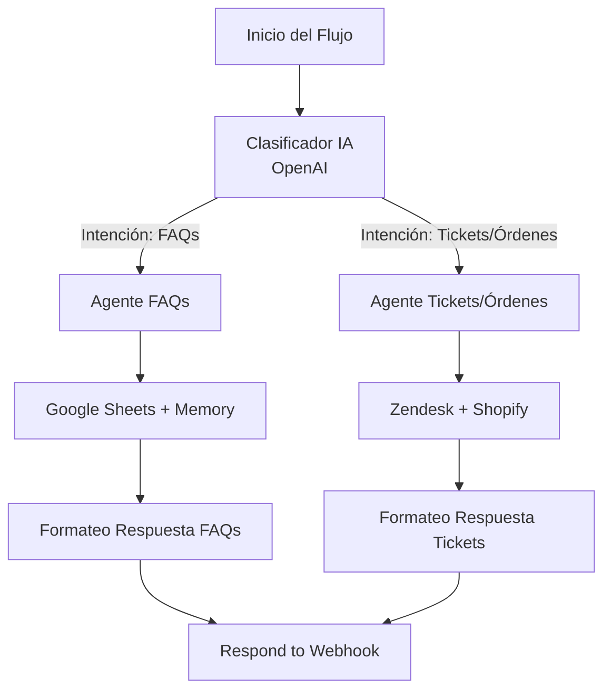

### ✅ Aquí tienes tu `README.md` **actualizado, completo y documentado visualmente**:

# 🤖 Proyecto: AI Agent - Servicio a Cliente (n8n)

> Versión General: V1.5.0  
> Workflow Principal: Demostración AI-Agent V1.2.2  
> Fecha de creación: 21-04-2025  
> Última actualización: 29-04-2025  

---

## 📘 Descripción General

Este proyecto implementa un **agente conversacional inteligente** para atención a clientes, creado en **n8n**.  
El sistema permite responder preguntas frecuentes (FAQs) y atender solicitudes relacionadas con órdenes o tickets en Shopify y Zendesk, usando herramientas de IA como **OpenAI Chat**, memoria contextual y acceso a APIs externas.

Incluye además **scripts en Python** para extracción de datos históricos, validación de roles y pruebas sobre las APIs activas.

---

## 🗺️ Diagrama del Flujo de Trabajo



---

## 📁 Estructura del Proyecto

```bash
AI_AGENT-N8N_260425_V1.5.0/
├── data/
│   ├── Preguntas frecuentes - ecomers.xlsx
│   ├── orders_21-25_april.csv
│   ├── customers_21-25_april.csv
│   ├── products_21-25_april.csv
│   └── tickets_21-25-april.csv
├── n8n_workflows/
│   ├── Demostraci_n_AI_Agent_V1_0_1.json
│   ├── Demostraci_n_AI_Agent_V1_2_0.json
│   └── Demostraci_n_AI_Agent_V1_2_2_(1).json
├── scripts/
│   ├── shopify_check_info_access.py
│   ├── shopify_export_data.py
│   ├── zendesk_check_info_access.py
│   ├── zendesk_export_tickets.py
├── log.txt
├── README.md
└── Reportes PDF + Evidencias
```

---

## 🛠️ Flujo n8n - Componentes Clave

### 🟡 Clasificación inicial
- Normalización y clasificación del mensaje del usuario (OpenAI).
- Split entre FAQs o Tickets según intención.

### 🟩 Agente de Dudas Frecuentes
- Conexión a Google Sheets.
- Uso de memoria contextual con Simple Memory.
- Formateo y envío de respuesta vía webhook.

### 🟢 Agente de Tickets y Órdenes
- Consulta a Zendesk (get ticket) y Shopify (get order).
- Validación semántica de correos, IDs de orden o etiquetas.
- Formato estándar para la respuesta final.

### ⚠️ Fallback
- Asegura respuesta incluso ante errores en APIs externas.

---

## 🐍 Scripts Python

| Script                       | Descripción                                                    | Estado |
|-----------------------------|----------------------------------------------------------------|--------|
| `shopify_check_info_access` | Verifica acceso y credenciales de tienda Shopify               | ✅     |
| `shopify_export_data`       | Exporta órdenes, productos y clientes como CSV                 | ✅     |
| `zendesk_check_info_access` | Consulta el rol de usuario actual y endpoints disponibles      | ✅     |
| `zendesk_export_tickets`    | Extrae tickets históricos para pruebas semánticas              | ✅     |

---

## 🧪 Validación por Herramienta

### Zendesk

- ✔️ Consulta de ticket por ID `#86535`
- ✔️ Consulta por correo: `z_cowan@hotmail.com`
- ✔️ Interpretación semántica: "problema de talla", "reembolso"

### Shopify

- ❌ Orden no encontrada por ID → posiblemente por uso de `name` en vez de `id`
- ❌ Clientes no localizados por email
- ⚠️ Requiere revisión de `scopes` y autorización API

---

## 📍 Pruebas semánticas realizadas

```plaintext
Hola, quiero saber el estado de mi ticket (#86535)
¿Pueden decirme qué pasó con el ticket #86535?
¿Mi orden #8029456400483 ya fue enviada?
¿El ticket #86535 está vinculado a una orden?
Tuve un problema con el pedido que hice con el correo z_cowan@hotmail.com
```

---

## 🚀 Cómo Ejecutar

```bash
# En n8n
1. Importar flujo .json desde /n8n_workflows/
2. Configurar credenciales API
3. Activar el workflow

# (Opcional) Ejecutar scripts Python
pip install -r requirements.txt
python scripts/zendesk_export_tickets.py
python scripts/shopify_export_data.py
```

---

## ⚙️ Notas de Configuración

- **Google Sheets:** Compartido en modo lectura al bot.
- **Zendesk:** Token API conectado y rol válido (Agent).
- **Shopify:** Conexión aceptada, pero sin respuesta de endpoints.
- **Memoria:** Conectada a nivel de agente, no global.
- **Telegram Trigger:** Inestable desde la red interna (pendiente).

---

## 📦 Tecnologías Usadas

- n8n (v1.x)
- OpenAI API
- Google Sheets API
- Shopify REST API
- Zendesk API
- Python 3.10+
- Librerías: `requests`, `pandas`

---

## 📎 Archivos de Evidencia

- `Reporte_AI_Agent_Servicio_Cliente_n8n_V1.5.0_JT.pdf`
- `orders_21-25_april.csv`, `tickets_21-25-april.csv`
- Capturas de flujo y respuestas del chatbot

---

## ✍️ Autor

**Jacob Tinoco**  
📧 jtinoco@maximaapparel.com  
📅 Última actualización: 29-04-2025

---
